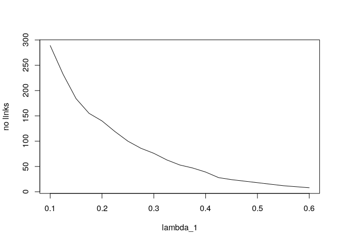
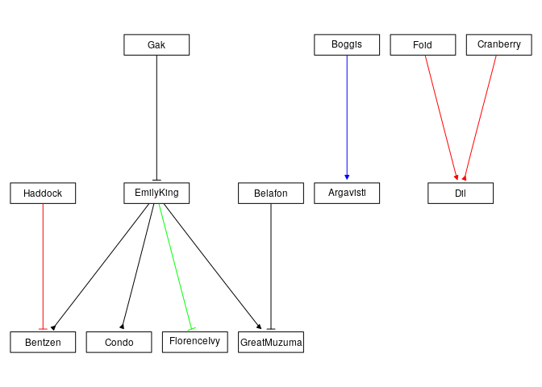
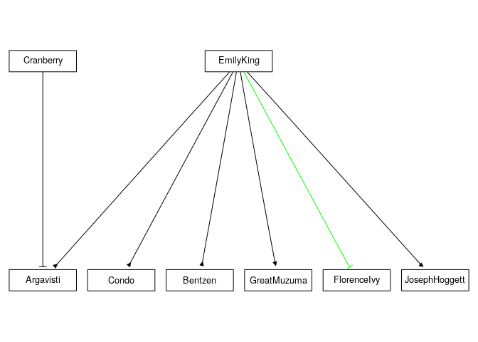

# Fused EPoC Guide

This is a guide to how to perform a Fused EPoC analysis.
First installation of software will be covered and then how to perform an analysis with an included dataset.

# Installation

The solver package can be installed directly from <http://github.com/> inside R using `devtools` 

```r
require('devtools')
install_github('tabenius/fusedepoc')
```
or downloaded manually and installed using

```bash
unzip ~/Downloads/fusedepoc-master.zip
R CMD INSTALL fusedepoc-master
```

The graphical user interface depend on a working `node` and `npm` installation. It lets you work with solution sets graphically. It can be installed by first, downloading <https://github.com/tabenius/fusedepoc-gui/archive/master.zip>, second, unpacking it and third, run the `setup.sh` script to install the required dependencies. When a solution set is prepared it will be bundled with the GUI instance. These steps will be covered below.

# The `fusedepoc` package

After installation, start R and 

```r
require('fusedepoc')
```

## Included realistic data

In this guide data included in the package will be used. Load it and see what it contains using

```r
data(realistic)
ls(realistic)
```

```
## [1] "CNA"         "description" "mRNA"        "species"
```
`description` is a vector with bogus names of cancer types.
`species` is a vector of bogus gene names randomly picked from Terry Pratchet's Discworld characters.
`mRNA` and `CNA` are lists with one element for each cancer type. Each element contains an array of $N \times p$ values. $N$ is the number of patients for this cancer type and $p$ is the number of genes. Genes are matched across cancer types and patients are matched between mRNA and CNA data.

```r
K <- length(realistic$description)
sapply(1:K,
  function(k) dim(realistic$mRNA[[k]])
)
```

```
##      [,1] [,2] [,3]
## [1,] 1095  512  188
## [2,]   50   50   50
```
The three cancer types has $p=50$ genes with 1095, 512, 188 patients ($N$) respectively.

## Running a simple analysis

To find a solution for this data set use

```r
lambda1s <- seq(0.1,0.6, by=0.025)
result <- with(realistic,
  fusedepoc(mRNA, CNA, 
            lambda1=lambda1s,lambda2=0.15,
            method='G', trace=0)
)
```
A matrix is found in  the result

```r
dim(result$coefficients)
```

```
## [1] 50 50  3 21  1
```
with dimensions corresponding to n.o. genes x n.o. genes x n.o. cancer types x n.o. lambda1s x n.o. lambda2s.
How many links did we get with these penalisation parameters for the first cancer type?

```r
plot(lambda1s, 
  sapply(1:length(lambda1s),
    function(L1i) netsize(result$coefficients[,,1,L1i,1])
  ),
  type='l',
  xlab='lambda_1',
  ylab='no links'
)
```

<!-- -->


To fetch a graph structure with indices given for $\lambda_1, \lambda_2$ use

```r
gr4 <- getGraph(21,1,result,realistic$species)
```

```
## [1] "Foid~Dil"           "0.0354673878470898"
## [1] "Gak~EmilyKing"      "0.0294647768290702"
## [1] "EmilyKing~Condo"    "0.0531706925741492"
## [1] "EmilyKing~Bentzen"  "0.0143342748335383"
## [1] "EmilyKing~GreatMuzuma" "0.0459543219914325"   
## [1] "EmilyKing~FlorenceIvy" "0.543993520602145"    
## [1] "Cranberry~Dil"     "0.055601828853892"
## [1] "Boggis~Argavisti"   "0.0229327337080804"
## [1] "Belafon~GreatMuzuma" "0.0742690883653229" 
## [1] "Haddock~Bentzen"    "0.0491838425927941"
```
All links are printed with their respective magnitudes. To plot this graph using `Rgraphviz`

```r
require(Rgraphviz)
#gr <- layoutGraph(gr4$graph, edgeAttrs=gr4$edgeAttrs, nodeAttrs=gr4$nodeAttrs, name="Gene regulatory network")
renderGraph(gr4)
```

<!-- -->
The colors in this graph represent 

* black--link present in all cancer types
* red--link present only in cancer type 1
* green--link present only in cancer type 2
* blue--link present only in cancer type 3

The two types of links are

* arrow means stimulation
* broken line means inhibits

The stabilisation included in Fused EPoC run the solver 10 times on 90% of the data, take the mean of the resulting coefficients and have a higher threshold of what it takes to be included as a link in the network. Now to run the stabilisation with relative $\lambda_1$ around what was previously used but with several $\lambda_2$ run the code below.


```r
lambda1s <- seq(0.4, 0.7, by=0.025)
lambda2s <- seq(0.01, 0.25, by=0.05)
result <- with(realistic,
  fusedepoc(mRNA, CNA, 
            lambda1=lambda1s,lambda2=lambda2s,
            method='G', trace=0, stabilise=TRUE)
)
```

```r
gr.stab <- getGraph(1,4,result,realistic$species)
```

```
## [1] "EmilyKing~Condo"   "0.177099752090837"
## [1] "EmilyKing~Argavisti" "0.0482157309112509" 
## [1] "EmilyKing~Bentzen" "0.129469109476299"
## [1] "EmilyKing~GreatMuzuma" "0.148593818274018"    
## [1] "EmilyKing~FlorenceIvy" "1.59152792578664"     
## [1] "EmilyKing~JosephHoggett" "0.121311100652095"      
## [1] "Cranberry~Argavisti" "0.141647710534651"
```

```r
#gr <- layoutGraph(gr.stab$graph, edgeAttrs=gr.stab$edgeAttrs, nodeAttrs=gr.stab$nodeAttrs, name="Gene regulatory network")
renderGraph(gr.stab)
```

<!-- -->
Possible hypotheses are e.g.

* EmilyKing inhibits FlorenceIvy (with by far the strongest link at magnitude 1.59) only in cancer type 2 (all other links wanted to fuse at the $\lambda_2=0.16$ level).
* EmilyKing is a hub and act as a stimulator of sorts. It stimulates all species except FlorenceIvy.

The results can be saved for further inspection in the GUI by

```r
json <- fusedepocToJSON(result, realistic$species, realistic$description)
savejson(json, filename="result.js")
```

## Bundling results in to a GUI

The `result.js` is, by default, a javascript module ready for inclusion in a standalone javascript GUI (webserver included). 


```bash
cd fusedepoc-gui-master
cp result.js static/js
bash compile.sh
```


```bashoutput
Transpiling with babel. Send SIGINT (Ctrl-c) when you want to browserify
src/main.js -> static/js/main.js
```

Now the application is compiled but to be suitable to run on the client side (in the browser) it needs to be bundled into a single script together with all dependencies and the result set. To do this `browserify` is used which is invoked with sending a SIGINT with Ctrl-c. After this step the compiler resumes into transpilation mode but since the bundle now is finished compilation can be terminated with `Ctrl-z` and `kill %1` where 1 is the job number shown as below.


```bashoutput2
^CBrowserifying
Transpiling with babel. Send SIGINT (Ctrl-c) when you want to browserify
^Z
[1]+  Stopped                 bash compile.sh
fusedepoc-gui-master$ kill %1
```

Now the GUI is ready to be started with the included web server

```bashweb
$ ./node_modules/http-server/bin/http-server 
Starting up http-server, serving ./
Available on:
  http://127.0.0.1:8080
```
Make sure to use <http://localhost:8080> (port might change) instead of `127.0.0.1` as security restrictions (CORS) for the gene information features don't work with ip adresses.

## Using the GUI online
To use the GUI online the result json needs to be stored somewhere. We do not provide such capabilities but either you publish the `result.js` somewhere on a server of your own or you use an online service. There are many online services that lets you store your json online for free. Below it is shown how to use the <http://jsonstorage.net> service directly from R.


```r
require(httr)
```

```
## Loading required package: httr
```

```r
json <- fusedepocToJSON(result, realistic$species, realistic$description)
URI <- "https://jsonstorage.net/api/items/"
response <- POST(URI, body = json, encode="raw", content_type("application/json"))
http_status(response)
```

```
## $category
## [1] "Success"
## 
## $reason
## [1] "Created"
## 
## $message
## [1] "Success: (201) Created"
```

```r
content(response)
```

```
## $uri
## [1] "https://jsonstorage.net/api/items/f32e3ccf-a96d-44b5-86b8-ef923cc32e41"
```

When you have a result file in json somewhere online, go to
<http://epoc.med.gu.se/abenius/fusedepoc-gui/> and use it.
